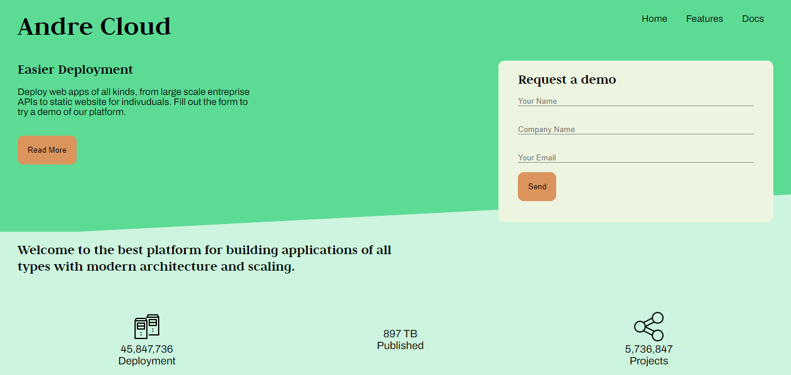
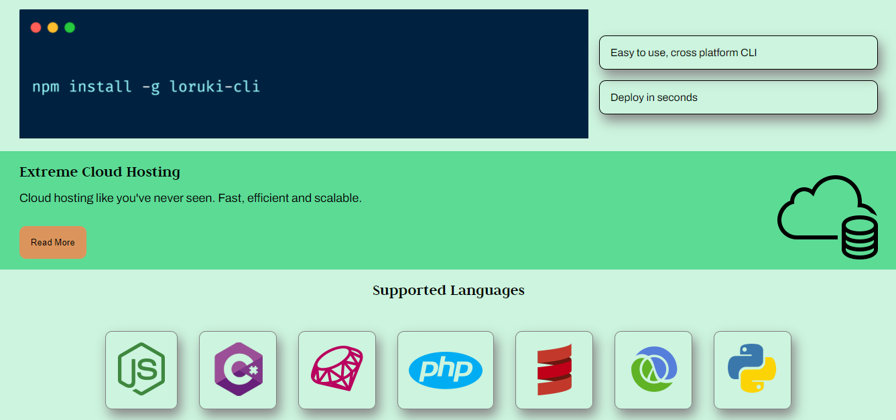
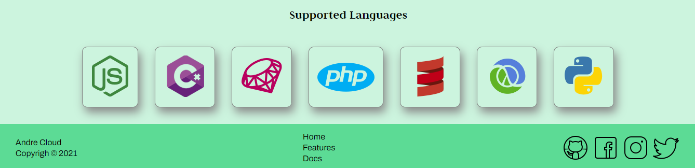
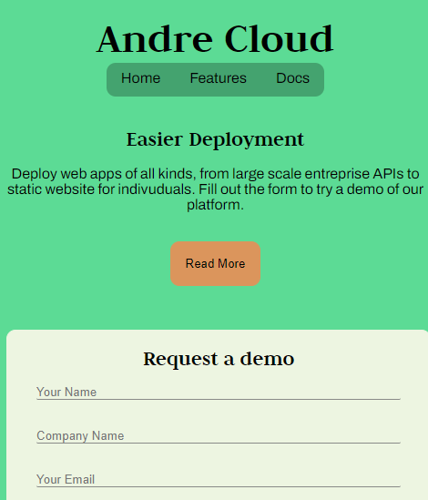
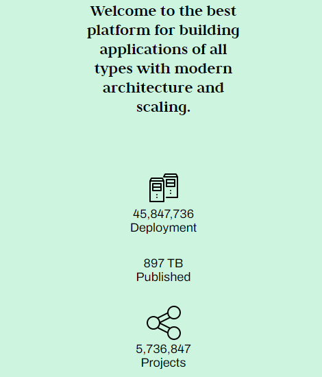
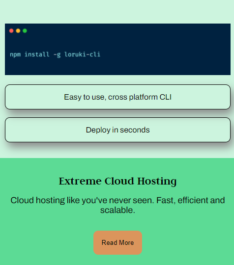
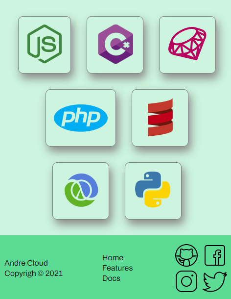

# Andre-Cloud ☁️
**A professional Landing Page template designed for SaaS or Cloud Service providers.**

## ✨ Highlights
* **Conversion-Oriented Design**: Structured to drive user action with clear CTA sections.
* **Cross-Browser Compatibility**: Tested on Chrome, Firefox, and Safari.
* **Pure CSS**: No external dependencies or heavy libraries.

## Preview

## 🛠 Quick Start
1. Clone: `git clone https://github.com/TheStephAndre/Andre-Cloud.git`
2. Edit content in `index.html`.
3. Open in any browser to preview.

## License

